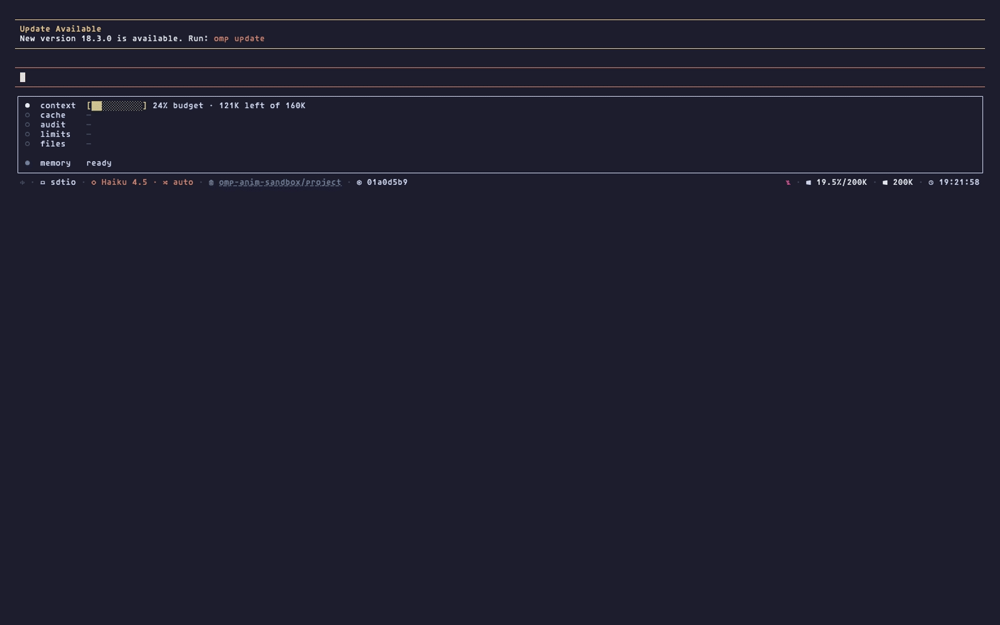

# @oh-my-pi/animations

A truthful terminal telemetry plugin for [oh-my-pi](https://omp.sh). One
controller mounts one Animations Box below (or above) the editor, plus an
optional signal sidecar above it — every number sourced from real host
events, never eased or simulated. Motion stops on a non-TTY terminal, in CI,
under `NO_COLOR`, or under render pressure.

## Demo



Three parallel scout subagents run inside a live `omp` session. Agent Bonsai
tracks each subagent's lifecycle while the Audit Box updates context budget,
cache reuse, file audit, rate-limit headroom, and job/verify state in real
time — recorded with [VHS](https://github.com/charmbracelet/vhs)
(`.media/demo.tape`, regenerate with `vhs .media/demo.tape`).

## Contents

- [Install](#install)
- [Features](#features)
- [Signal extras](#signal-extras)
- [The Animations Box](#the-animations-box)
- [Settings](#settings)
- [Requirements](#requirements)
- [Develop](#develop)
- [License](#license)

## Install

From a local checkout:

```bash
git clone git@github.com:caretak3r/omp-animations.git
cd omp-animations
bun install     # required once: a local install links the checkout as-is,
                # it does not resolve dependencies for you
omp plugin install .
```

Straight from git, without a manual clone:

```bash
omp plugin install git+ssh://git@github.com/caretak3r/omp-animations.git
```

This form resolves its own dependencies — no separate `bun install` step.
While the repository stays private, it needs the installing machine's own
git credentials (SSH key or token) for `github.com`.

Either form registers one plugin entry (`package.json#omp.extensions`,
pointing at `src/registrar.ts`), which reads settings synchronously and
mounts the Animations Box through one controller.

## Features

- **Agent Bonsai** — Main and every reachable subagent, each with a stable
  cohort ID, lifecycle state, model, context, and current task, plus a
  trailing row of recent tool/skill/file activity. Bounded to 8 visible
  agents and 3 activity sub-rows; anything cut is still named in a trailing
  `… +N more` line, so a failed agent is never silently dropped.
- **Audit Trail** — marks every touched file `FRESH`, `DIRTY`, `POISONED`,
  `REDUNDANT`, or `COLD`. Run `/audit-trail` for the full list, or
  `/audit-trail remedy` to re-read files the agent no longer trusts.
- **Breathing Border** — a pulse along the Audit Box perimeter that tracks
  the pace of the last turn and winds down when the agent finishes.
- **Cache Meter** — recent prompt-cache reuse (averaged over the last ten
  requests) and session request count. Run `/cache` for the full
  provider/model/cost breakdown.
- **Live Files** — paths an active edit or write call currently owns, from
  Main and streamed subagent progress; each path disappears when its call
  ends.
- **Rate-Limit Tidepool** — headroom from the last response's rate-limit
  headers (Anthropic and OpenAI only), refilling on the provider's own reset
  clock.

## Signal extras

The signal sidecar mounts above the editor. Each row renders only while its
signal has meaningful state — an idle sidecar shows zero rows, not a
placeholder.

| Signal | Shows | Default |
| --- | --- | --- |
| Recurrence Strip | The current turn repeats the previous turn's tool sequence | on |
| Context Rewrite Shadow | Estimated vs. provider-reported context tokens | on |
| Compaction Scar | Tokens cut by compaction, and reads since | on |
| Consent Lock | A pending tool approval | on |
| Session Phylogeny | Branch depth and sibling count | on |
| Think/Act Lissajous | Balance of thinking text vs. answer text | off |
| Error Isotope | A repeated tool-failure signature | on |
| Skill Chromatograph | Skills actually used this turn | on |
| Retry Radar | Active retry attempt, max attempts, delay | on |
| Verify | Writes landed since the last green bash | on |
| Auth Beacon | A provider credential auto-disabled | on |
| Async Job Harbor | Running/ready/failed/cancelled background jobs | on |
| Goal Heading | Goal status and token budget (never the goal text) | off |
| TTFT Split | Reported time-to-first-token vs. completion time | on |
| Memory Backend Tide | Memory backend state and recent recall outcomes | on |

**Darkroom Title** projects critical state into the terminal title instead
of a row; it defaults off.

## The Animations Box

The box holds these required rows, in order:

1. `context` — budget fill, model-window usage, turn headroom
2. `cache` — prompt-cache reuse and saved cost
3. `audit` — file trust
4. `limits` — provider rate-limit headroom
5. `files` — active edit/write paths

Agent Bonsai and the signal extras are optional groups in the same box; a
row that has nothing to say renders nothing. The retired `display` setting
(`rows` / `box` / `both`) is ignored — a stale `rows` or `both` value logs
one warning and still mounts the full box. Older per-row `*Placement` /
`*AccentColor` settings from before the single-box consolidation (e.g.
`cacheMeterPlacement`) no longer select a separate surface; only
`animationsBoxPlacement` does.

## Settings

The plugin reads every setting through the omp plugin settings channel,
each with an `OMP_*` environment fallback (stored settings win).

| Setting | Values | Default | Env fallback |
| --- | --- | --- | --- |
| `animations` | `off` \| `subtle` \| `full` | `subtle` | `OMP_ANIMATIONS` |
| `animationsBoxDetail` | `simple` \| `readable` \| `detailed` | `readable` | `OMP_ANIMATIONS_BOX_DETAIL` |
| `animationsBoxPlacement` | `aboveEditor` \| `belowEditor` | `belowEditor` | `OMP_ANIMATIONS_BOX_PLACEMENT` |
| `animationsContextQuota` | `5`–`100` | `80` | `OMP_ANIMATIONS_CONTEXT_QUOTA` |
| `agentBonsai` | boolean | `true` | `OMP_ANIMATIONS_AGENT_BONSAI` |
| `agentRosterDetail` | `compact` \| `verbose` | `compact` | `OMP_ANIMATIONS_AGENT_ROSTER_DETAIL` |
| `animationsBonsaiSettleSeconds` | `0`–`86400` | `300` | `OMP_ANIMATIONS_BONSAI_SETTLE_SECONDS` |
| `breathingBorder` | boolean | `true` | `OMP_ANIMATIONS_BREATHING_BORDER` |
| `liveFiles` and each [signal extra](#signal-extras) | boolean | see table above | `OMP_ANIMATIONS_<ID>` |
| `darkroomTitle` | boolean | `false` | `OMP_ANIMATIONS_DARKROOM_TITLE` |

`animationsBonsaiSettleSeconds` keeps completed agents visible for that many
seconds; the minimum announcement window is `800ms` regardless of tier.

The main transcript's shimmer on a running subagent's name is host UI
(`display.shimmer`), not this plugin — the plugin only mounts widgets, it
has no hook into the host's own text rendering. Pair
`omp config set display.shimmer disabled` with `agentBonsai: true` to make
the Audit Box the one place that reports "an agent is working."

Read and change settings with:

```bash
omp plugin config set @oh-my-pi/animations animations subtle
omp plugin config set @oh-my-pi/animations animationsContextQuota 80
omp plugin config list @oh-my-pi/animations
```

## Requirements

- Bun 1.3.14 or later.
- oh-my-pi 17 or later. The plugin imports agent signals from
  `@oh-my-pi/pi-coding-agent`'s internal subpath export, which is not a
  stable contract across oh-my-pi major versions — pin the major version.

## Develop

```bash
bun install      # resolves pi-coding-agent / pi-tui / pi-utils from npm
bun run fix      # biome check --write --unsafe
bun run check    # biome + tsgo type-check
bun test         # behavioral test suite
```

Unit tests prove the box renders what the code says; they can't prove the
box is *right* — only a live session can. Two scripts close that loop
against a running `omp` in tmux:

```bash
bun run probe -- --session omp-anim --interval 2   # sample until you stop it
bun run probe:lint                                  # grade the newest run
```

`probe` writes every capture to a unique `.frames/run-<timestamp>/`.
`probe:lint` grades the newest run's paths, values, separators, alignment,
and borders; exit `0` is clean, `1` is a violation, `2` means no Audit Box
was identifiable.

## License

MIT — see [LICENSE](LICENSE).
